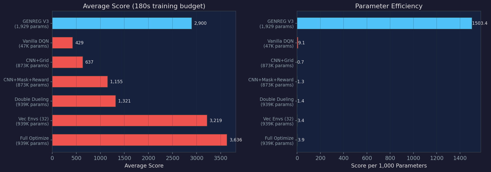
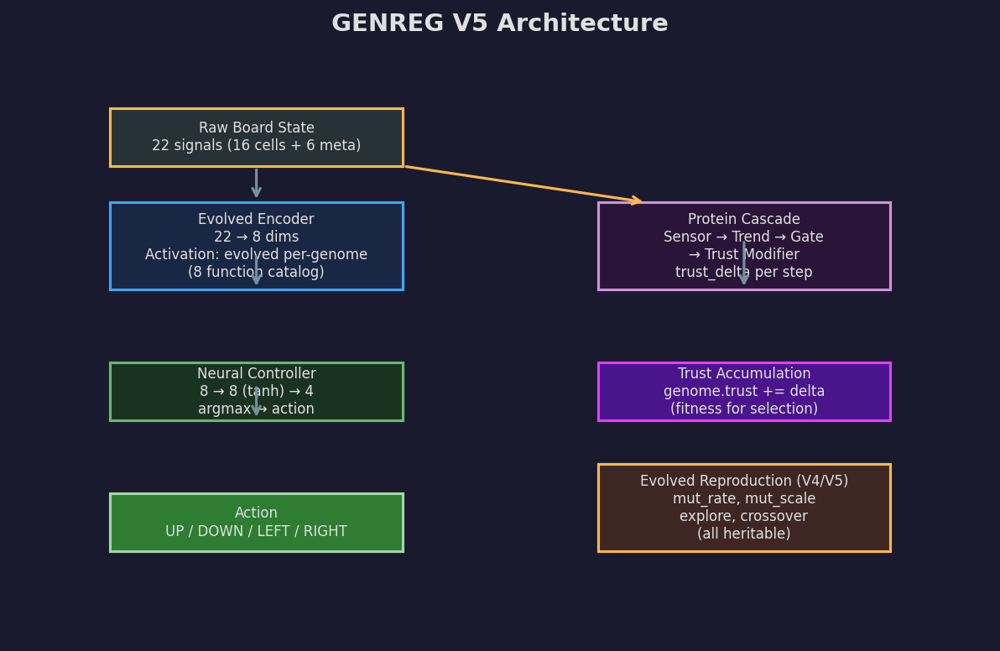
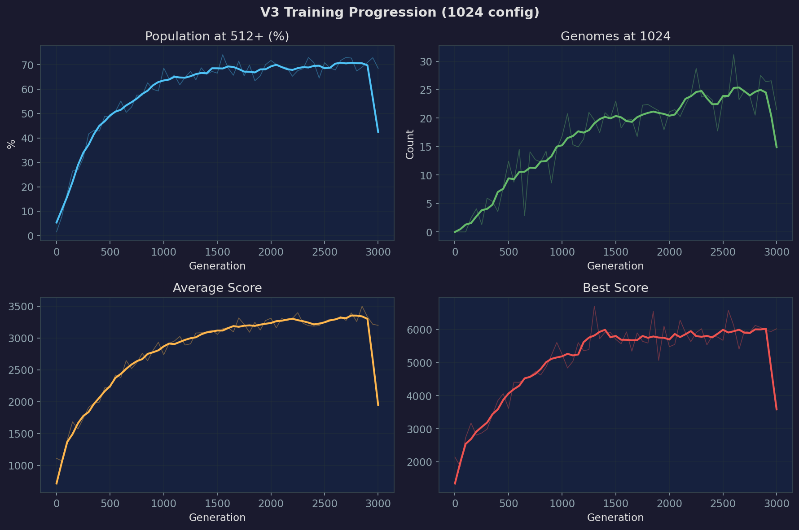
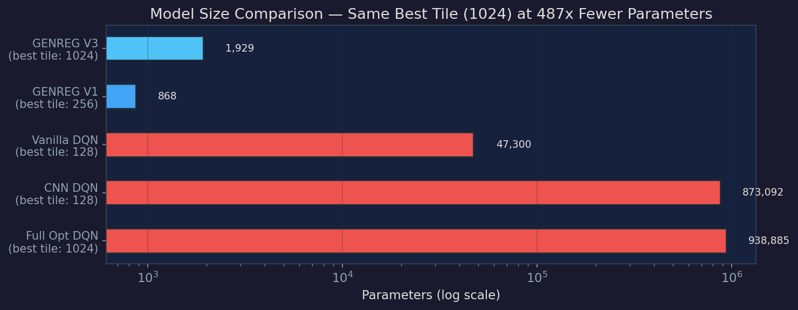
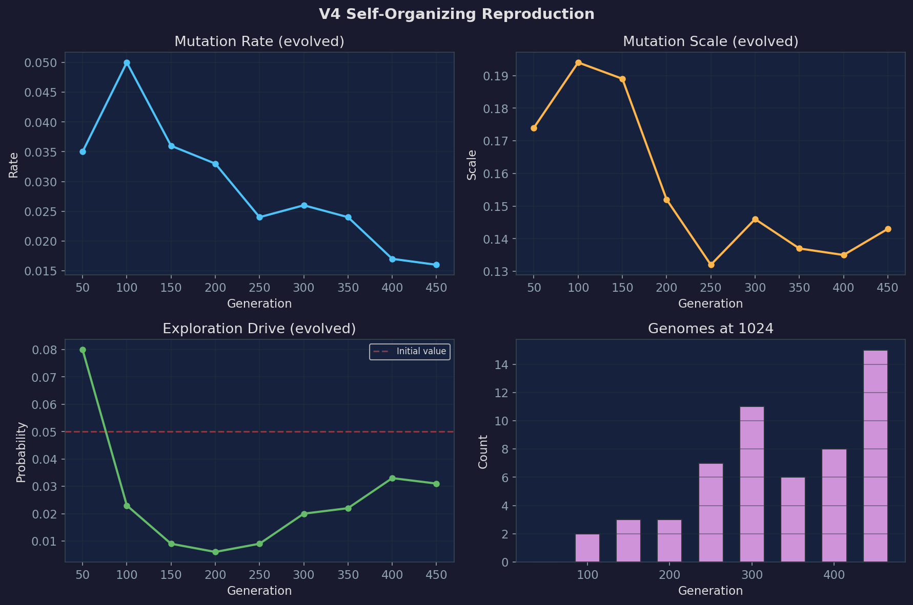

[README.md](https://github.com/user-attachments/files/26524715/README.md)
# GENREG 2048 — Gradient-Free Neuroevolution Demo

A gradient-free evolutionary system that learns to play 2048 using trust-based selection, evolved perception, and self-organizing reproductive strategies. No backpropagation. No gradients. No reward shaping. Just evolution.



## Quick Start

```bash
# Install dependencies
pip install torch torchvision pygame matplotlib

# Train V5 (headless, GPU-accelerated)
python genreg_2048_app.py --headless_v5

# Train V3 (simpler, no evolved reproduction)
python genreg_2048_app.py --headless_v3

# Full GUI mode (pygame + tkinter control panel)
python genreg_2048_app.py
```

Training opens a control panel where you can adjust parameters, monitor live statistics, view charts, and run inference on trained genomes.

## Architecture Versions

| Version | What It Adds | Parameters/Genome |
|---------|-------------|-------------------|
| V1 | Flat MLP controller + protein trust system | ~868 |
| V3 | Evolved encoder with activation catalog (8 functions) | ~1,929 |
| V4 | Per-genome reproductive strategy (evolved mutation rate/scale/exploration) | ~1,932 |
| V5 | Neuron-level crossover between elite parents | ~1,933 |

### V5 Architecture



```
Raw Board State (22 signals)
    │
    ▼
Evolved Encoder (22 → 8)
    Linear transform + evolved activation
    (one of 8 activation functions, selected per-genome)
    │
    ▼
Neural Controller (8 → 8 → 4)
    Hidden layer (tanh) → Output layer → argmax
    │
    ▼
Action (UP / DOWN / LEFT / RIGHT)
```

Each genome also carries:
- **Protein cascade**: sensor, trend, comparator, integrator, gate, and trust-modifier proteins that compute fitness over the course of a game
- **Reproductive traits**: per-genome mutation rate, mutation scale, exploration drive, and crossover probability — all evolvable

## What Makes This Different

**No gradients.** The entire system learns through evolutionary selection. Genomes that play better survive and reproduce. There is no loss function, no backpropagation, no optimizer.

**Trust-based fitness.** Instead of a hand-crafted reward function, each genome accumulates "trust" through a protein cascade that processes game signals over time. The proteins themselves evolve — the system learns what to reward, not just how to play.

**Evolved perception.** The encoder activation function is selected from a catalog of 8 nonlinearities and tuned per-genome by evolution. Each genome sees the board through a different mathematical lens. The population converges on the activation that works best for the task.

**Self-organizing reproduction (V4/V5).** Each genome carries heritable traits that control how its children are mutated. The population discovers its own mutation strategy — typically converging on rare but large mutations rather than constant small noise.

## Current Results



Training consistently reaches **1024 tiles** within a few hundred generations. The population typically stabilizes with:
- 70-80% of genomes reaching 512
- 2-5% reaching 1024
- Best single-game scores around 7,000-8,500

2048 has not been reached in training. At inference (playing many games with the best genome), 1024 appears in roughly 1-2% of games.

### DQN Benchmark Comparison



A fully-optimized DQN baseline (938,885 parameters, CNN architecture, action masking, reward shaping) reached a best tile of 1024 with average score of 3,636 in the same time budget. GENREG V3 reaches the same milestone with ~1,929 parameters — a 487x compression ratio.

Interactive comparison: [assets/dqn_comparison_interactive.html](assets/dqn_comparison_interactive.html)

### Self-Organizing Reproduction (V4/V5)



When genomes control their own mutation parameters, the population self-organizes toward low-frequency, high-magnitude mutations. The exploration drive initially drops near zero, then recovers when breakthrough genomes (1024) enter the elite pool through ratchet protection.

Interactive version: [assets/repro_interactive.html](assets/repro_interactive.html)

## Configuration

Load the `1024` config from the control panel for a good starting point. Key parameters:

| Parameter | Default | Description |
|-----------|---------|-------------|
| population_size | 100-1000 | More genomes = more diversity, slower gens |
| hidden_size | 8 | Hidden layer neurons (also sets encoder dim) |
| n_games | 3-5 | Games per genome per generation (reduces noise) |
| starting_energy | 30 | Energy budget per game |
| survival_pct | 20 | Top N% survive as elite |
| trust_inherit | 60 | Children inherit 60% of parent trust |
| child_mutation | 0.05 | Global mutation rate (V3) / fallback rate (V4/V5) |
| ratchet_strength | 2.0 | How strongly high-tile genomes are protected |
| proximity_strength | 2.0 | Score-based gradient toward next tile milestone |

## File Structure

```
demo/
├── genreg_2048_app.py       # Main app (GUI + headless training + inference)
├── genreg_2048_env.py       # 2048 game environment
├── genreg_controller.py     # Neural network controller (CPU)
├── genreg_genome.py         # Genome and population (CPU)
├── genreg_proteins.py       # Protein cascade (trust computation)
├── genreg_encoder.py        # Evolved encoder (CPU, for inference)
├── genreg_encoder_gpu.py    # Evolved activation catalog (GPU)
├── genreg_gpu.py            # GPU batch game + base evolver
├── genreg_gpu_v3.py         # V3: evolved encoder
├── genreg_gpu_v4.py         # V4: evolved reproduction
├── genreg_gpu_v5.py         # V5: crossover
├── genreg_checkpoint.py     # Save/load checkpoints
├── genreg_logger.py         # Training logger
├── checkpoints/             # Saved model state
├── logs/                    # Training logs
└── configs/                 # Saved configurations
```

## Requirements

- Python 3.10+
- PyTorch 2.0+ (with CUDA for GPU training)
- pygame (for GUI mode)
- matplotlib (for training charts)
- NVIDIA GPU recommended (CPU training is very slow)

## Theory

This system is built on a framework described in ["Designing the Landscape: A Theory of Optimization as Environment Construction"](https://www.reddit.com/r/IntelligenceEngine/) (Miller, 2026). The central idea is that the fitness landscape — what gets rewarded and how — is more important than the choice of optimization method. Gradient descent and genetic algorithms are viewed as equivalent traversal strategies on a designable landscape.

Key observations from development:
- **The landscape determines the outcome.** Every major improvement in GENREG's performance came from redesigning the fitness signal, not from changing the network architecture or the evolutionary algorithm.
- **Evolved perception matters.** Adding an evolved encoder (V3) compressed time-to-first-milestone by orders of magnitude. The population starts with diverse perceptual hypotheses and selects the ones that work.
- **Populations self-organize their diversity.** When given control over their own mutation rates (V4), populations converge on low-frequency, high-magnitude mutations — fewer but bigger bets.
- **Checkpoints must preserve evolved state.** Multiple serialization bugs were found where checkpoint save/load destroyed per-neuron activation parameters, creating apparent training plateaus that were actually data-loss artifacts.

## Known Limitations

- 2048 tile has not been reached. The 1024-to-2048 gap appears to require sustained play over thousands of moves with near-perfect strategy, which may exceed the capacity of an 8-neuron hidden layer.
- No spatial awareness. The controller sees the board as a flat vector, not a 2D grid. A CNN-like architecture would likely perform better but would not be gradient-free.
- Invalid move rate is ~40%. The model wastes significant energy on moves that don't change the board. Action masking (as used by the DQN baseline) would help but is intentionally not used — the model must learn to avoid invalid moves on its own.

## License

This project is shared for research and educational purposes. See the main repository for license details.

---

*GENREG — Gradient-free intelligence through evolved landscapes.*
